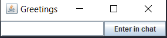
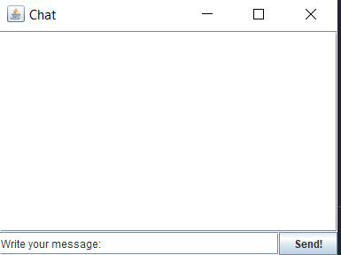

# Simple network chat using sockets.

Window for entering the username:

Then the chat itself opens:

## Configuration

**You can configure which ports the servers will run on along the way:**

servers/src/main/java/Main.java

**If you change the ports on the server side, you will also need to change them on the client side along the path:**

client/src/front/ClientGreetings.java

client/src/front/ClientWindow.java

Technologies
------------
Project is created with:
* Java version: 8
* Hibernate
* Google gson
* MySQL: 8.0.19

